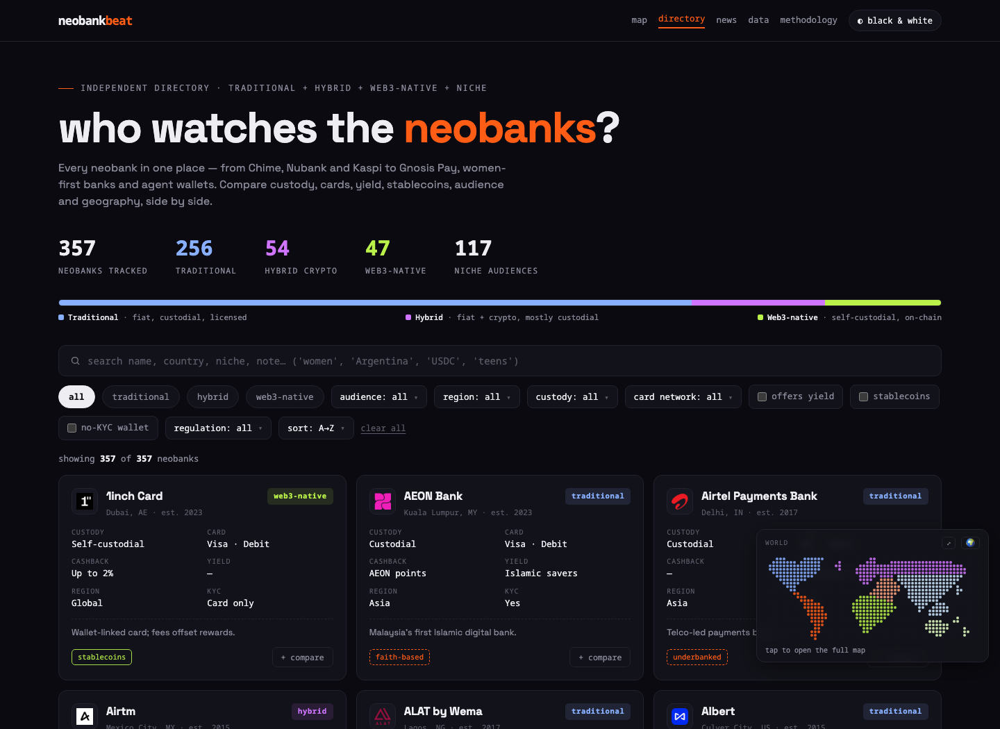
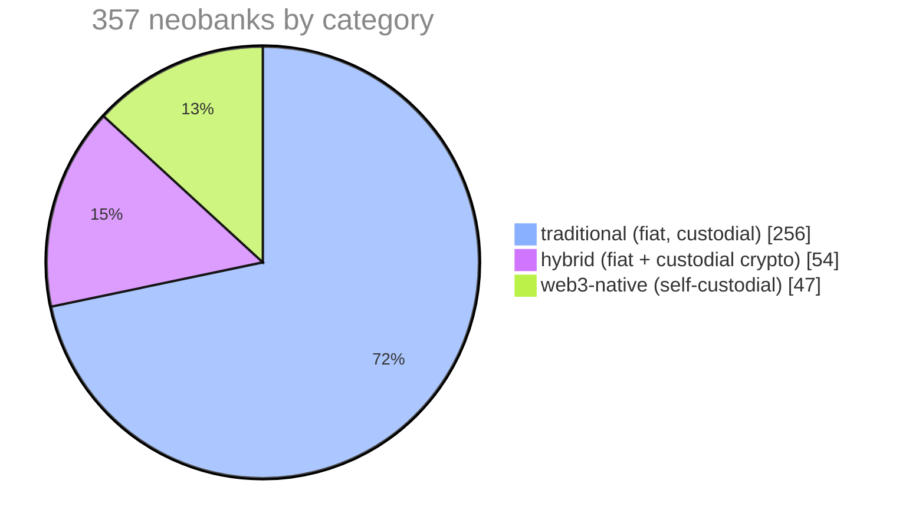
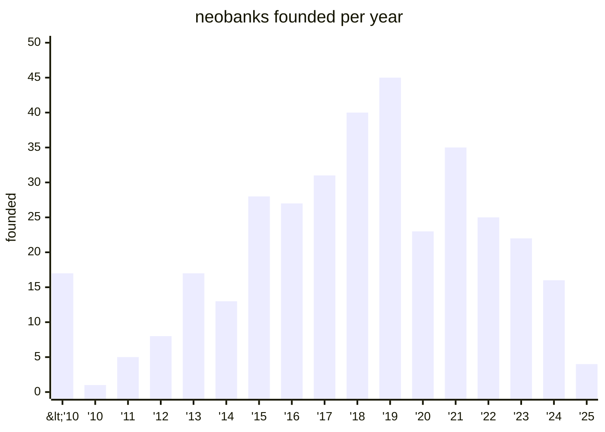
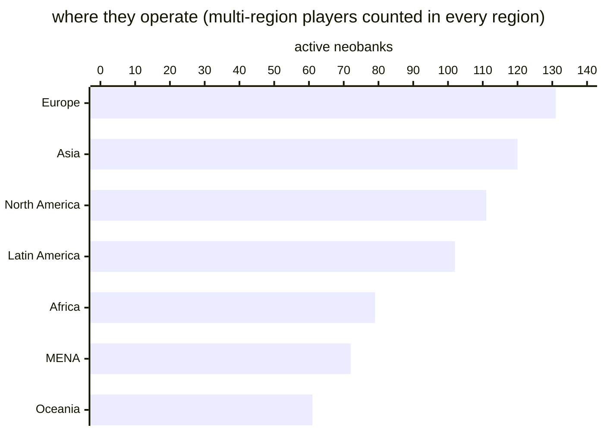

<div align="center">

# neobankbeat 🦊

**who watches the neobanks?**

[](https://www.neobankbeat.com)
[](https://www.neobankbeat.com)
[](tests/flowtest.js)
[](https://www.neobankbeat.com/data.json)
[](LICENSE)

an independent, open-source directory of **357 verified-active neobanks** across three waves:<br>
**traditional** (Chime, Nubank, Kaspi…) · **hybrid** fiat+crypto (Revolut, Cash App, RedotPay…) · **web3-native** self-custodial money apps (MetaMask, Gnosis Pay, Payy…)<br>
plus the niche-audience generation and super-app wallets.

inspired by [Walletbeat](https://beta.walletbeat.eth.limo) and [L2Beat](https://l2beat.com). built accordingly.

[**→ neobankbeat.com**](https://www.neobankbeat.com)

<a href="https://www.neobankbeat.com"></a>

</div>

## the dataset at a glance



the three waves are visible in the founding years — challengers after 2011, the mobile-first boom peaking in 2019, and the web3-native wave arriving after 2020:





more numbers from the current dataset:

| | |
|---|---|
| niche-audience neobanks (women-first, gen z, immigrants, faith-based…) | **117** |
| with stablecoin support | **103** |
| licensed banks (charters, digital-bank licences) | **92** |
| verified terms & privacy links (checked, not guessed) | **126** |
| official X handles on file | **151** |
| no-KYC self-custodial wallets | **12** |

## what's inside

- **[directory](https://www.neobankbeat.com)** — 357 verified-active entities; filter by category, custody, region, country, audience niche, regulation, stablecoin support; side-by-side compare tray. filters live in the URL, so views are shareable: [`?cat=W&map=AF`](https://www.neobankbeat.com/?cat=W&map=AF) = web3-native in Africa
- **[map](https://www.neobankbeat.com/#mapsec)** — dot-matrix world map with region → country drill-down, plus a floating mini-map
- **[data](https://www.neobankbeat.com/#datasec)** — nine charts: reported users, founding waves, researched volume watch (every figure links to its filing), the stablecoin card curve, region × category matrix, the neobank paradox, global banked adults, stablecoin supply 2030 scenarios, how stablecoins get spent
- **profiles** — verified terms & privacy links, official X handles, founder LinkedIns (verified tier only), countries of operation, users/volume tiles, peers, regulation type with links to the official registers (ESMA MiCA, EBA, FCA, SEC EDGAR, NMLS)
- **[library](https://www.neobankbeat.com/#library)** — 14 vetted industry reports (direct PDFs flagged) + the full resources stack
- **[news](https://www.neobankbeat.com/#newssec)** — curated headline watch

## for machines & AI agents

neobankbeat is built to be a source of truth for agents, not just humans:

| resource | what it is |
|---|---|
| [`data.json`](https://www.neobankbeat.com/data.json) | the full dataset as clean JSON — all 357 entities, every field, with sources. no HTML parsing needed |
| [`llms.txt`](https://www.neobankbeat.com/llms.txt) | agent guide: what this site is, data semantics, field caveats, how to cite |
| JSON-LD in the page head | `WebSite` + `Dataset` schema, marks the directory as a citable open dataset |

`data.json` is regenerated from the live page (so it can never drift from the site):

```bash
cd tests && node export-data.js
```

## architecture

the whole app is **one self-contained `index.html`** — no build step, no backend, no framework. deploy the repo root anywhere static (Vercel: drop it in, done). the root also ships `data.json`, `llms.txt`, `robots.txt`, `sitemap.xml` and the OG/icon images.

```
index.html          the entire app: CSS + data + logic
├── const D=[...]   357 entities, one row each
├── const X={...}   enrichment: founders, licences, funding, stories
└── const V={...}   verified links: terms, privacy, X handles, countries
data.json           machine-readable export (generated, committed)
llms.txt            agent-facing guide
tests/
├── flowtest.js     167 assertions across 23 user flows (JSDOM)
└── export-data.js  regenerates data.json from index.html
```

## data principles

1. **verified-active only** — defunct neobanks and pure BaaS/infrastructure are excluded by design
2. **no fabricated links** — unverified fields fall back to honest search links, never guessed URLs
3. **sources on everything** — volume figures link to filings; charts cite their reports
4. **"up to" rates** — cashback/yield figures change constantly; always confirm with the issuer

## contributing

the dataset lives in `index.html` as `const D=[...]` (one row per entity) with a verified-links layer in `const V={...}`. two ways in:

- **[+ submit a neobank](https://github.com/andreolf/neobankbeat/issues/new?labels=new-neobank&template=new-neobank.yml)** — pre-filled issue form
- **[suggest a correction](https://github.com/andreolf/neobankbeat/issues/new?labels=data-fix&template=data-fix.yml)** — spotted a wrong figure or dead link?

or PR directly — see [CONTRIBUTING.md](CONTRIBUTING.md) for the row schema. before submitting:

```bash
cd tests && npm install
node flowtest.js       # 167 assertions must pass
node export-data.js    # regenerate data.json, commit it with your change
```

## license

MIT — do whatever, credit appreciated. made with ❤ & 🦊 by [francesco](https://www.francesco-andreoli.com) · still early
