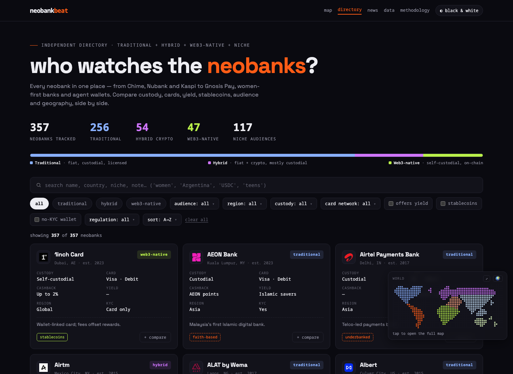
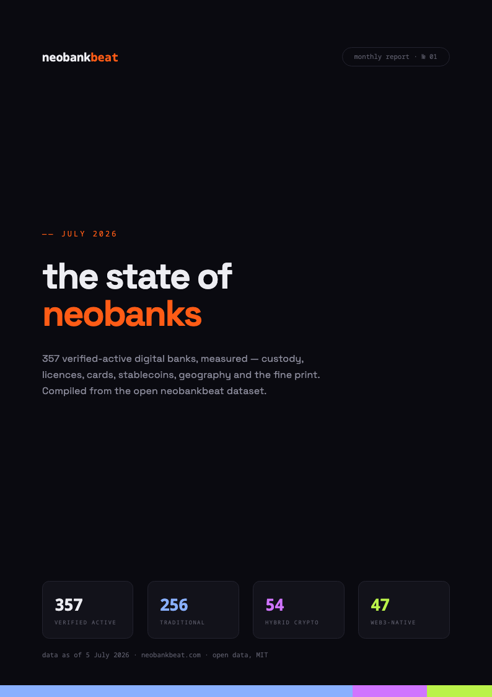
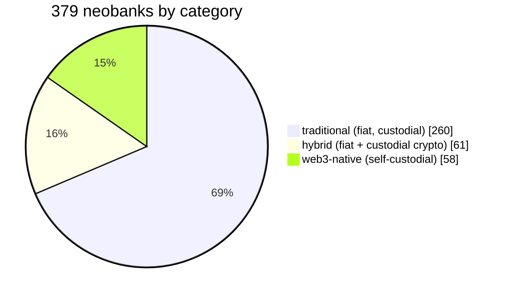
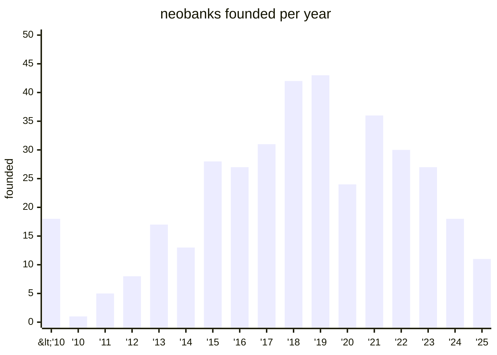
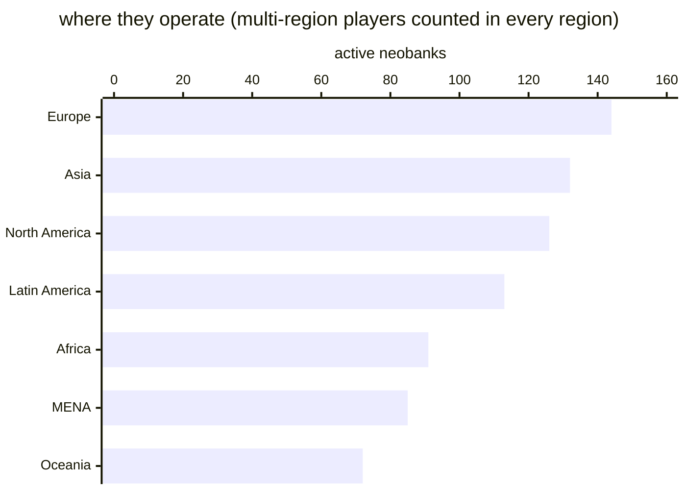

<div align="center">

# neobankbeat 🦊

**who watches the neobanks?**

[](https://www.neobankbeat.com)
[](https://www.neobankbeat.com)
[](tests/flowtest.js)
[](https://www.neobankbeat.com/data.json)
[](LICENSE)

an independent, open-source directory of **379 verified-active neobanks** across three waves:<br>
**traditional** (Chime, Nubank, Kaspi…) · **hybrid** fiat+crypto (Revolut, Cash App, RedotPay…) · **web3-native** self-custodial money apps (MetaMask, Gnosis Pay, Payy…)<br>
plus the niche-audience generation and super-app wallets.

inspired by [Walletbeat](https://beta.walletbeat.eth.limo) and [L2Beat](https://l2beat.com). built accordingly.

[**→ neobankbeat.com**](https://www.neobankbeat.com)

<a href="https://www.neobankbeat.com"></a>

</div>

## the state of neobanks — monthly report

<a href="https://www.neobankbeat.com/report/"></a>

a 57-page designed PDF measuring the industry every month — custody, licenses, cards, stablecoins, geography, niches, future narratives — generated entirely from `data.json`.

| edition | full pdf (free, gated) | preview online |
|---|---|---|
| **№ 01 — July 2026** | [get the report](https://www.neobankbeat.com/report/) | [first 5 chapters](https://www.neobankbeat.com/report/2026-07/) |

subscribing to the (free) newsletter is the only gate — the download starts instantly on the site. every figure is reproducible from the open dataset.

<br clear="right">

<!-- stats:start -->
## the dataset at a glance


```mermaid
pie showData title 379 neobanks by category
    "traditional (fiat, custodial)" : 260
    "hybrid (fiat + custodial crypto)" : 61
    "web3-native (self-custodial)" : 58
```

the three waves are visible in the founding years — challengers after 2011, the mobile-first boom peaking in 2019, and the web3-native wave arriving after 2020:


```mermaid
xychart-beta
    title "neobanks founded per year"
    x-axis ["<'10", "'10", "'11", "'12", "'13", "'14", "'15", "'16", "'17", "'18", "'19", "'20", "'21", "'22", "'23", "'24", "'25"]
    y-axis "founded" 0 --> 50
    bar [18, 1, 5, 8, 17, 13, 28, 27, 31, 42, 43, 24, 36, 30, 27, 18, 11]
```


```mermaid
xychart-beta horizontal
    title "where they operate (multi-region players counted in every region)"
    x-axis ["Europe", "Asia", "North America", "Latin America", "Africa", "MENA", "Oceania"]
    y-axis "active neobanks" 0 --> 160
    bar [144, 132, 126, 113, 91, 85, 72]
```

more numbers from the current dataset:

| | |
|---|---|
| niche-audience neobanks (women-first, gen z, immigrants, faith-based…) | **126** |
| with stablecoin support | **121** |
| licensed banks (charters, digital-bank licenses) | **132** |
| running on a partner bank (BaaS) | **81** |
| with AI verifiably in production | **67** |
| verified terms & privacy links (checked, not guessed) | **120** |
| official X handles on file | **170** |
| no-KYC self-custodial wallets | **14** |
<!-- stats:end -->

## what's inside

- **[directory](https://www.neobankbeat.com)** — 379 verified-active entities; filter by category, custody, region, country, audience niche, regulation, stablecoin support; side-by-side compare tray. filters live in the URL, so views are shareable: [`?cat=W&map=AF`](https://www.neobankbeat.com/?cat=W&map=AF) = web3-native in Africa
- **[map](https://www.neobankbeat.com/#mapsec)** — dot-matrix world map with region → country drill-down, plus a floating mini-map
- **[data](https://www.neobankbeat.com/#datasec)** — nine charts: reported users, founding waves, researched volume watch (every figure links to its filing), the stablecoin card curve, region × category matrix, the neobank paradox, global banked adults, stablecoin supply 2030 scenarios, how stablecoins get spent
- **profiles** — verified terms & privacy links, official X handles, founder LinkedIns (verified tier only), countries of operation, users/volume tiles, peers, regulation type with links to the official registers (ESMA MiCA, EBA, FCA, SEC EDGAR, NMLS)
- **[library](https://www.neobankbeat.com/#library)** — 14 vetted industry reports (direct PDFs flagged) + the full resources stack
- **[news](https://www.neobankbeat.com/#newssec)** — curated headline watch

## for machines & AI agents

neobankbeat is built to be a source of truth for agents, not just humans:

| resource | what it is |
|---|---|
| [`data.json`](https://www.neobankbeat.com/data.json) | the full dataset as clean JSON — all 379 entities, every field, with sources. no HTML parsing needed |
| [`llms.txt`](https://www.neobankbeat.com/llms.txt) | agent guide: what this site is, data semantics, field caveats, how to cite |
| JSON-LD in the page head | `WebSite` + `Dataset` schema, marks the directory as a citable open dataset |

`data.json` is regenerated from the live page (so it can never drift from the site):

```bash
cd tests && node export-data.js
```

## architecture

**two files, no framework** — `index.html` is markup and CSS, `app.js` is the data and the logic. no bundler, no backend: deploy the repo root anywhere static (Vercel: drop it in, done). the root also ships `data.json`, `llms.txt`, `robots.txt`, `sitemap.xml` and the OG/icon images.

the split exists because the app used to be one 346KB file, so every crawler and cold visitor downloaded 283KB of code to read 60KB of content, and none of it could be cached apart from the content. `app.js` is referenced with a content hash (`/app.js?v=…`) and served `immutable`, so it is fetched once. `tests/build-app-js.mjs` keeps that hash in step — edit `app.js` directly, then run it.

```
index.html          markup, CSS, JSON-LD, and one <script src="/app.js?v=…">
app.js              the app: data + logic (cached immutably)
├── const D=[...]   379 entities, one row each
├── const X={...}   enrichment: founders, licenses, funding, stories
├── const INV={...} notable early investors per entity (public rounds)
└── const V={...}   verified links: terms, privacy, X handles, countries
data.json           machine-readable export (generated, committed)
llms.txt            agent-facing guide
blog/               static deep dives + RSS feed
jobs/               live job board pulled from official ATS APIs (+ data.json feed)
report/             gated landing page for the monthly PDF report
reports/            generated report source + PDF (robots-disallowed)
n/                  379 generated entity profile pages (SEO surface)
vs/                 140 generated head-to-head comparison pages
browse/             index of every ready-made cut of the dataset
regulation/ kyc/ regions/ for/   24 generated topic hubs (one license, KYC posture,
                    region or audience each — the filters, as linkable pages)
tests/
├── flowtest.js     281 assertion sites across 39 user flows (JSDOM)
├── export-data.js  regenerates data.json from app.js
├── build-app-js.mjs keeps app.js and index.html's ?v= hash in step (--check)
├── homepage-js.mjs  the one place that knows where the homepage's JS lives
├── sync-blog-asof.mjs stamps dated posts whose counts no longer match live data
├── build-pages.mjs regenerates /n/, /vs/ and sitemap.xml from data.json
├── build-jobs.mjs  refreshes /jobs/ from Greenhouse/Lever/Ashby APIs
├── build-report.mjs generates the monthly 50+ page State of Neobanks PDF
├── build-agents.mjs generates openapi.json and .well-known/* from data.json
├── footer.mjs      the site footer, defined once
├── meta.mjs        the <head> description and breadcrumb rules, defined once
├── sync-footers.mjs pushes the nav + footer into hand-written HTML (--check for drift)
├── sync-crumbs.mjs gives hand-written pages a BreadcrumbList (--check for gaps)
├── sync-tables.mjs scopes every table header cell (--check for gaps)
└── sync-counts.mjs  fixes dataset totals restated in prose (--check for drift)
```

### the nav and the footer

`tests/footer.mjs` is the only place either one is defined — `NAV_LINKS` for the
header, `FOOTER_LINKS` for the footer. Generated pages import it at build time;
the blog and the other hand-written pages have no build step, so
`node tests/sync-footers.mjs` rewrites them in place, preserving whichever link
each page had marked as current. Add a link there and nowhere else, then run:

```sh
node tests/build-pages.mjs && node tests/build-changelog.mjs && node tests/sync-footers.mjs && node tests/sync-crumbs.mjs && node tests/sync-tables.mjs
```

That is one command for 1,642 pages, which is why `/browse/` could be added to
the nav at all.

The homepage keeps its own grouped footer on purpose — columns, on-page anchors
and a disclaimer that would be noise on an inner page — and its nav swaps three
links for on-page anchors, being the page those links point at. Both are held to
the weaker rule that they can't *omit* a destination. Flowtest flow 27 fails on
any drift, which is how 19 blog posts were caught with no link to `/data/` at all.

### numbers written in prose

Every count the site states in English — 379 neobanks, 23 FAQ answers, 219
investors, 140 comparisons — is owned by `tests/sync-counts.mjs`, which anchors
each claim by the words around it and rewrites only the digits. Before it existed
the site simultaneously published three different dataset totals, three different
FAQ answer counts, and claimed 60 comparisons when it had 140. Write prose freely;
run the script (or any build) and the numbers correct themselves. Flow 30 fails on
drift.

The same applies to the agent surface: `openapi.json`, `.well-known/api-catalog`
and `.well-known/agent-skills/*` are **generated** by `tests/build-agents.mjs`,
never hand-edited. The skill's `sha256` has to match its `SKILL.md` or discovery
clients drop the skill, so it is computed on every build.

### the monthly report is a snapshot

A published edition must keep saying what the PDF readers downloaded says.
`build-report.mjs` therefore reads `report/<slug>/data-snapshot.json`, committed
next to the edition, instead of live `data.json` — otherwise re-running the build
rewrites a shipped edition's figures while leaving its "data as of" date alone.
For a new edition: bump `MONTH`/`EDITION`/`ED_SLUG`, `cp data.json
report/<slug>/data-snapshot.json`, then rerun.

## badge

tracked on neobankbeat? embed the badge — it links people to your verified profile:

[](https://www.neobankbeat.com/)

```markdown
[](https://www.neobankbeat.com/n/YOUR-SLUG/)
```

## data principles

1. **verified-active only** — defunct neobanks and pure BaaS/infrastructure are excluded by design
2. **no fabricated links** — unverified fields fall back to honest search links, never guessed URLs
3. **sources on everything** — volume figures link to filings; charts cite their reports
4. **"up to" rates** — cashback/yield figures change constantly; always confirm with the issuer

## contributing

the dataset lives in `app.js` as `const D=[...]` (one row per entity) with a verified-links layer in `const V={...}`. two ways in:

- **[+ submit a neobank](https://github.com/andreolf/neobankbeat/issues/new?labels=new-neobank&template=new-neobank.yml)** — pre-filled issue form
- **[suggest a correction](https://github.com/andreolf/neobankbeat/issues/new?labels=data-fix&template=data-fix.yml)** — spotted a wrong figure or dead link?

or PR directly — see [CONTRIBUTING.md](CONTRIBUTING.md) for the row schema. before submitting:

```bash
cd tests && npm install
node flowtest.js       # every assertion must pass
node export-data.js    # regenerate data.json, commit it with your change
node build-pages.mjs   # regenerate /n/, /vs/ and sitemap.xml
```

monthly report (edit the `MONTH`/`EDITION` constants, then):

```bash
cd tests && node build-report.mjs
# print reports/report-src.html to PDF with headless Chrome (A4, no headers)
```

## license

MIT — do whatever, credit appreciated. made with ❤ & 🦊 by [francesco](https://www.francesco-andreoli.com) · still early
